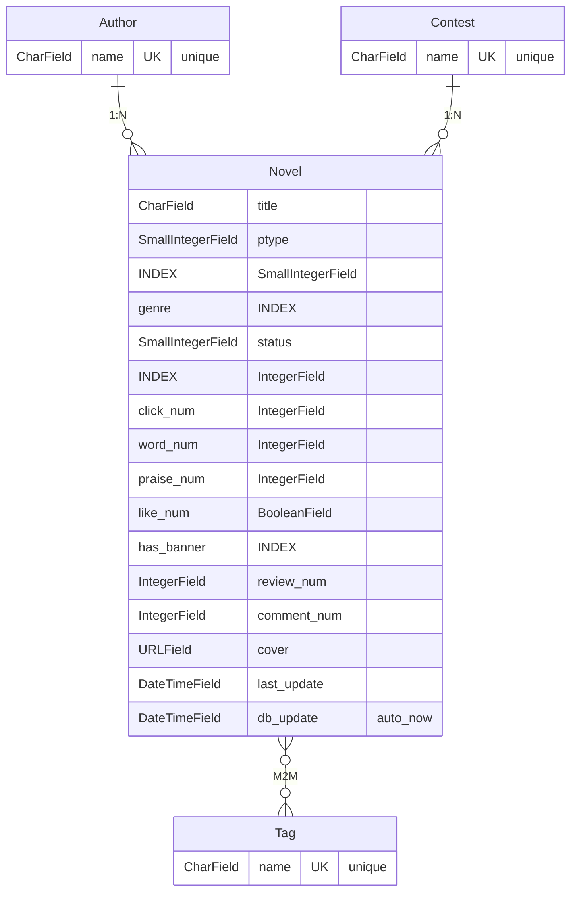

# Novel Hub

## Database ER Diagram

### Relationships
1. Author  : Novel  →  One-to-Many (`ForeignKey`, `on_delete=SET NULL`)
2. Contest : Novel  →  One-to-Many (`ForeignKey`, `on_delete=SET NULL`)
3. Novel   : Tag    →  Many-to-Many (`ManyToManyField`)

### Mappings (Context Processor)

Enum fields `ptype`, `genre`, `status` store integer values mapped via `Mapping` class:

| Field   | Values (en → zh)                              |
|---------|-----------------------------------------------|
| genre   | magic→魔幻, eastern→玄幻, ancient→古风, sci_fi→科幻, school→校园, urban→都市, game→游戏, doujin→同人, mystery→悬疑 |
| status  | finished→已完结, on_going→连载中, died→断更    |
| ptype   | free→免费, sign→签约, vip→VIP                 |

Unknown values fall back to `OTHER` (index 1).
