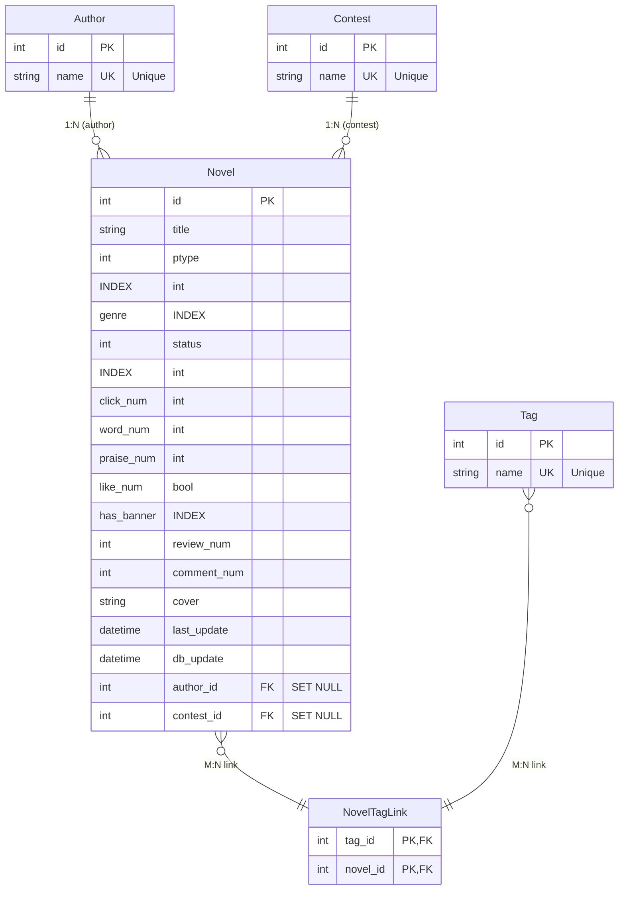

# Novel Hub

## Database ER Diagram



### Database ER Diagram (Text Version)
```text
+----------------+        +-------------------------------------------+        +----------------+
|     Author     |        |                  Novel                    |        |    Contest     |
+----------------+        +-------------------------------------------+        +----------------+
| id        (PK) |<--1:N--| id              (PK)                      |--1:N-->| id        (PK) |
| name      (UK) |        | title                                     |        | name      (UK) |
+----------------+        | ptype           (INDEX)                  |        +----------------+
                          | genre            (INDEX)                  |
                          | status           (INDEX)                  |
                          | click_num                                 |
                          | word_num                                  |
                          | praise_num                                |
                          | like_num                                  |
                          | has_banner       (INDEX)                  |
                          | review_num                                |
                          | comment_num                               |
                          | cover                                     |
                          | last_update                               |
                          | db_update                                 |
                          | author_id        (FK, ON DELETE SET NULL)|
                          | contest_id      (FK, ON DELETE SET NULL)|
                          +-------------------------------------------+
                                          ^
                                          |
                          +---------------+---------------+
                          |         NovelTagLink          |
                          +-------------------------------+
                          | tag_id     (PK, FK)            |
                          | novel_id   (PK, FK)            |
                          +-------------------------------+
                                          |
                                          v
                          +-------------------------------+
                          |              Tag               |
                          +-------------------------------+
                          | id         (PK)                |
                          | name       (UK)                |
                          +-------------------------------+
```

### Relationship Description
1. Author  : Novel  →  One-to-Many
2. Contest : Novel  →  One-to-Many
3. Novel   : Tag    →  Many-to-Many

### Field Constraint
- PK    : Primary Key 
- FK    : Foreign Key 
- UK    : Unique Key 
- INDEX : Database Index 

### Relation Explain
1. **Author ↔ Novel**: One-to-Many, `ON DELETE SET NULL`
2. **Contest ↔ Novel**: One-to-Many, `ON DELETE SET NULL`
3. **Novel ↔ Tag**: Many-to-Many, use intermediate table `NovelTagLink`
4. Constraints
   - PK: Primary Key
   - FK: Foreign Key
   - UK: Unique Key
   - INDEX: Database Index