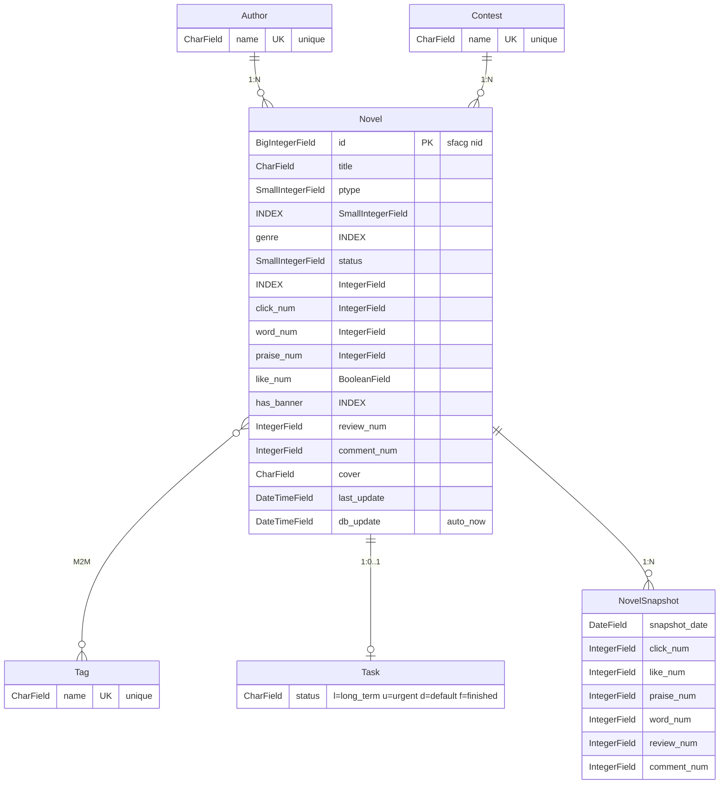

# Novel Hub

A novel metadata website for sfacg.com, built with Django + Tailwind CSS.

## Features

- Novel browsing and search
- Filter by genre, status, and ptype
- Multi-dimensional rankings (clicks, words, favorites, etc.)
- Author, tag, and contest browsing
- Banner novel showcase
- Dark mode support
- Mobile-responsive design
- Static site generation for GitHub Pages
- Snapshot system for tracking novel metrics over time

## Tech Stack

### Python (uv)

- **Django** — web framework, ORM, admin, template engine
- **Scrapy** — web spider for sfacg.com
- **pandas** — data processing pipeline
- **Pydantic** — data validation (shared Meta model)
- **plotly** — dashboard charts
- **requests** — HTTP client for scraping
- **lxml** — HTML parsing
- **tqdm** — progress bars
- **psycopg2-binary** — PostgreSQL driver
- **python-dotenv** — environment variables

### Node.js (pnpm)

- **Tailwind CSS** — CSS framework
- **htmx.org** — dynamic interactions without JavaScript

### Dev Tools

- **black** — code formatter
- **flake8** — linter
- **playwright** — E2E testing
- **pre-commit** — git hooks
- **faker** — test data generation

## Quick Start

```bash
# Install dependencies
uv sync && pnpm install

# Run migrations
uv run python manage.py migrate

# Load data
uv run python manage.py init_db ../release/dataset/

# Start dev server
uv run python manage.py runserver

# Build CSS
pnpm build
```

## Project Structure

```
novel_hub/
├── site_config.toml        # Shared config (single source of truth)
├── .env                    # Environment variables
├── utils/                  # Shared scraping + data processing
├── meta_spider/            # Scrapy spider
├── website/                # Django project
├── release/                # Dataset (JSONL + CSV)
└── docs/                   # Detailed documentation
```

## Documentation

| Module | README | Docs |
|--------|--------|------|
| utils | [utils/README.md](utils/README.md) | [docs/utils.md](docs/utils.md) |
| meta_spider | [meta_spider/README.md](meta_spider/README.md) | [docs/meta_spider.md](docs/meta_spider.md) |
| website | [website/README.md](website/README.md) | [docs/website.md](docs/website.md) |
| Commands | [commands/README.md](website/novels/management/commands/README.md) | [docs/commands.md](docs/commands.md) |
| Deployment | — | [docs/deployment.md](docs/deployment.md) |

## Database ER Diagram



## Testing

```bash
uv run python manage.py test novels -v 2
```

## License

MIT
