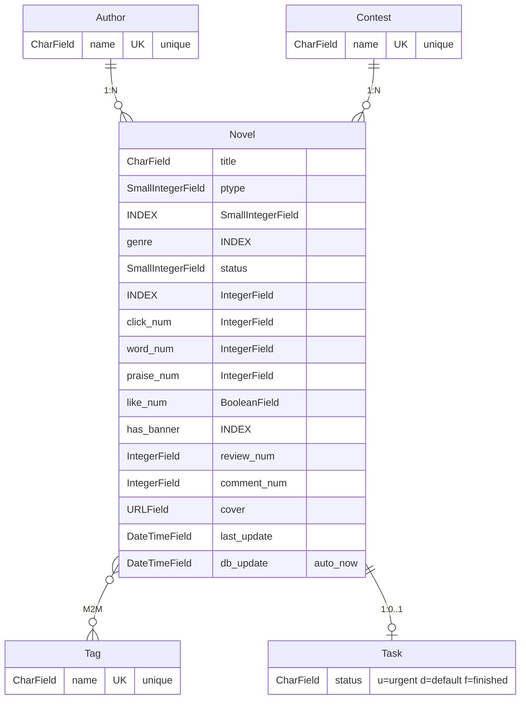

# Novel Hub

A novel metadata website for sfacg.com, built with Django + Tailwind CSS + HTMX.

## Features

- Novel browsing and search
- Filter by genre, status, and ptype
- Multi-dimensional rankings (clicks, words, favorites, etc.)
- Author, tag, and contest browsing
- Banner novel showcase
- Dark mode support
- Mobile-responsive design

## Tech Stack

- **Backend**: Django 6.0 + Python 3.13
- **Frontend**: Tailwind CSS 4.x + HTMX
- **Database**: SQLite (dev) / PostgreSQL (prod)
- **Data Collection**: Scrapy + pandas

## Database ER Diagram



### Relationships
1. Author  : Novel  →  One-to-Many (`ForeignKey`, `on_delete=SET_NULL`)
2. Contest : Novel  →  One-to-Many (`ForeignKey`, `on_delete=SET_NULL`)
3. Novel   : Tag    →  Many-to-Many (`ManyToManyField`)
4. Novel   : Task   →  One-to-One (`OneToOneField`, `on_delete=CASCADE`)

### Mappings (Context Processor)

Enum fields `ptype`, `genre`, `status` store integer values mapped via `Mapping` class:

| Field   | Values (en → zh)                              |
|---------|-----------------------------------------------|
| genre   | magic→魔幻, eastern→玄幻, ancient→古风, sci_fi→科幻, school→校园, urban→都市, game→游戏, doujin→同人, mystery→悬疑 |
| status  | finished→已完结, on_going→连载中, died→断更, active_d→断更D, active_f→完结F |
| ptype   | free→免费, sign→签约, vip→VIP                 |

Unknown values fall back to `OTHER` (index 1).

## Quick Start

```bash
# Install dependencies
uv sync

# Run migrations
uv run python manage.py migrate

# Create superuser
uv run python manage.py createsuperuser

# Load sample data
uv run python manage.py create_fake_data -n 1000

# Start development server
uv run python manage.py runserver

# Build Tailwind CSS
pnpm build
```

## Data Loading

For development with fake data:
```bash
uv run python manage.py create_fake_data -n 1000
```

For real data (after website development):
```bash
gh release download --repo <owner>/<repo>
uv run python manage.py load_jsonl ../dataset/data
```

## License

MIT
